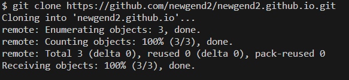

[home](./index.md)
## Creating a New GH-Pages Site

For this first part of homework 04 in BDS 311, you will be creating a GH-Pages site. Some of you may have started this process in class, while some of you may not have started at all. Either way, this will guide you through the process from scratch.

#### Part 1: Creating a new Repository
Go to <a href='https://github.com' target='_blank'>GitHub</a>. If you are logged in to your github account, you should be able to create a new repository by clicking the green button as pictured below:


Once clicked, you will be given options to configure your repository.

Your repository name must be of the format `<username>.github.io`. In other words, repository should include **the exact same name as your username**. If my username were BillyBob, my github website repository will be called `BillyBob.github.io`.

You also need to select add a .README file.

Once these 2 things are done (repo name, and selecting add .README). You should click the Create repository button at the bottom of the page.


<br>

#### Part 2: Accessing your GH pages website

After you click create repository, it will bring you to the repository page on github.

In the `Settings` Tab, click on the `Pages` Icon under the `Code and Automation` section on the left of the screen.

On the Pages section, you should see the text showing that your site is live with a provided link. It usually takes around half a minute for the link to show up, so try waiting and refreshing the page.

```
Note that the link to your GH pages site will be
https://<username>.github.io/
```


<br>

Go to your GH pages website, right now it should look like this.


<br>

#### Part 3: Cloning your GH pages repo to your computer.

When you clone a repository in Git, it creates a local copy of the entire repository. The cloned repository is linked to the remote repository on GitHub

On github, go to your GH pages repository and under the code button, copy the HTTPS link to clone the repo.


<br>

Once the link is copied, go to a place in your local file system where you want to clone your GH pages repo into. This will create a folder named <username>.github.io which is a linked clone of the remote repository on Github.

`This means that inside <username>.github.io, you can make changes, and commit/push them to the remote repository on github.`

<br>




#### Part 4: Populating your website


Your GH pages repository should have a Markdown file `README.md`. Change this file and commit/push these changes to github. The changes made to `README.md` will show up on `<username>.github.io`.

Next, on your local computer, in your repo, create a new markdown file called: `experience.md`. Add a few lines about some of your work or professional experience/plans. 

Add a link to your *experience* page in `README.md`. Commit and push these changes to the remote github repository.

These changes will show up in `<username>.github.io/experience`. There can by a delay between pushing and changes showing up on your site.

#### Part 5: Link your GitHub Repository to HW04

Back in `hw04.ipynb` in your hw04 repo, paste the link to your gh-pages website in question 1.
