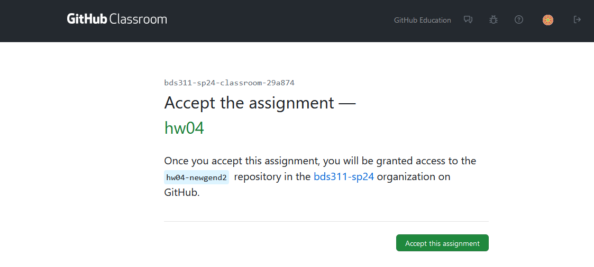
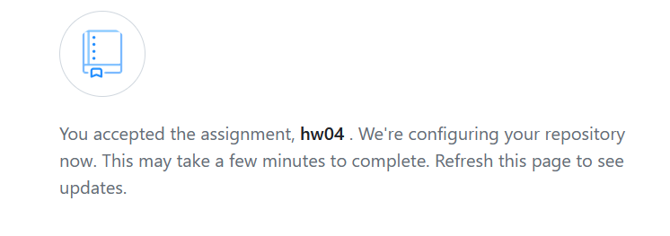
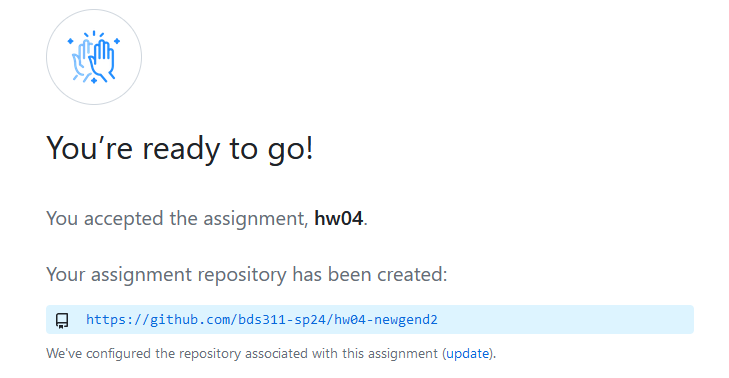
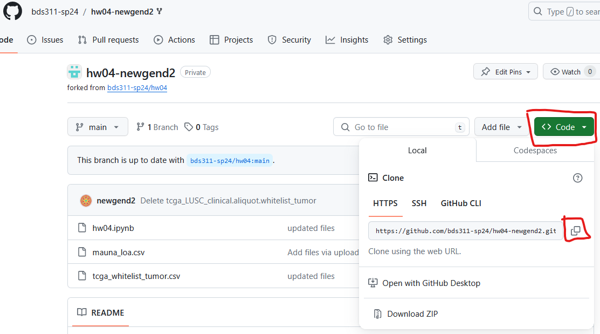
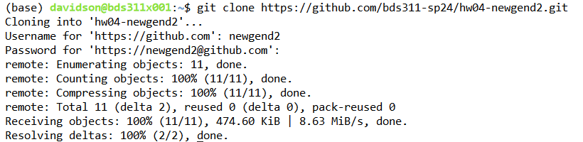

[home](./index.md)
## How can I clone my github classroom repository onto jupyterhub?

This page will go through the process of creating and cloning your hw04 repository onto jupyterhub
  
First off, you should enter the hw04 assignment link into your web browser.
### This should bring you to a page like this:  
 

 

### Clicking `accept this assignment` will bring up this page:
 

### Wait a few seconds and refresh the page. 
### Then click on the Link to your created hw04 repository  
  

   
### Copy the HTTPS link to clone:
Click the green code button and copy the HTTPS link to clone the repository
  

 
  
Now in Jupyterhub you can clone this repository by typing the command
`git clone <repo link>`

After you enter the command, git will want your github username, and `github access token`.  
Note that it is asking for your "password", but it actually wants your access token.  
You can copy paste the acces token into this field, just know it won't show any text when you do.  

#### If you don't have github access token, you can make one by doing these steps:

1. Go to github.com and log in.
2. In the top right click on your profile.
3. Go to `settings`.
4. Go to `<Developer settings>` (very bottom of left pane)
5. Click the drop down for `Personal access tokens` and select `Tokens (classic)`
6. Click `Generate new token` -> `Generate new token (classic)`
7. Set an expiration date.
8. Under `Select Scopes` just select the first box (repo)
9. Click `generate token`.
10. `Save` the token somewhere on your computer.

Running git clone will create a folder named `hw04-<github username>` which is the git repository  
  

 

All hw04 files are in this folder.  
Once you finish the questions in hw04.ipynb,   
save the notebook and stage it.

### `Commit` the changes you made to hw04.ipynb and `push` the commit to your remote hw04 repository.

### Don't forget to also upload your generated zip file to gradescope like we have done in past homeworks

