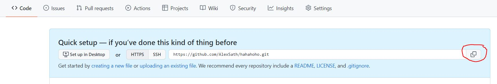
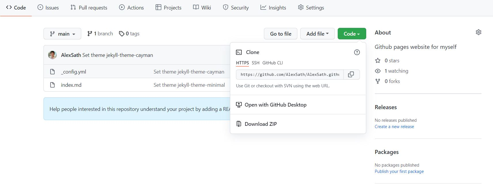
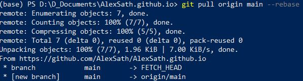
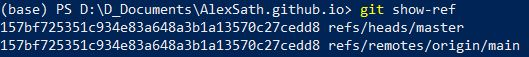

## How can I get Repositories onto my Local Machine?

This page will walk you through getting remote git repositories onto your local machine so that you can work on them yourself! There are a few different ways to do this 
1. Create a local repository using `git clone`
2. Create a local repository using `git init`
3. Create a personal copy of someone else's repository

### 1. Create a Local Repository using Git Clone

#### Step 1.1 - Get the Link to the Remote Repository
**We have just initialized the git repository**. We must now **Link the local repository to the remote repository on github**. To do this, we need to copy the `.git` link to the remote repository.

**Empty Repository**: If the repository in github is empty, it will look like this:



**Repository with Code**: In the code tab, click on the `code` button (in blue) and the `copy` botton (in red) as seen below



#### Step 1.2 - Clone the Remote Repository Into a Local Directory

Nativate to a directory where you would like a *new folder* containing the repository to be.

Type the following command, where you use the link you copied from **Step 1.1**.

```
git clone <repository_link>
```

Now, when you use the `ls` command, you should see a new folder with the same name as the repository you cloned. If you `cd` into that folder, you can change files and use git commands such as `git status`, `git add`, `git commit`, etc...

### 2. Create a Local Repository using Git Init

#### Step 1.2 - Create a Repository Directory
Go to your computer's local terminal. It should have git installed. Navigate to the desired directory, and create a new folder where you would like to create the new repository.
<br>

#### Step 2.2 - Initialize the Git Repository Locally
Navigate inside the folder. Type the command:

```
git init
```

After hitting enter, you should see a `.git` folder when you use the command `ls -a`.
<br>


#### Step 2.3 - Link Local Repository to Remote Repository
Follow the instructions in **Step 1.1** to get a link to the remote repository you would like to be using. Type the following command, using the link copied:

```
git remote add origin <repository_link>
```
<br>

#### Step 2.4 - Sync Local and Remote Repositories
If the remote repository has data that isn't currently synced to our local computer, **we must sync our local repository with the remote repository**. To do this, type the command below:

```
git pull origin main --rebase
```

*NOTE*: If you get an error saying `couldn't find remote ref`, this is likely because your remote branch is not called `main`. To check the name of your remote branch, go to the github site for your repository, and view the branch name at the circled location below:


Once this is done, you should see something like this:


<br>

#### Step 2.5 - Ensure that Local and Remote Branches are Synced
Now that we have synced up our repositories, we should **sync up local and remote branches (if necessary)**. This will make your life easier as you work on the repository on your locaal machine. 

Type the command `git show-ref`. You should see something like this:



Notice above that there are two refs - you can see the name of each branch as the last item in the ref path. Importantly in this example, **the refs are not the same**. <u>If your ref branches are the same, you are good to go!!</u>

If your refs are not the same like mine were in this instance, type the following two commands:

```
git checkout -b <remote_branch_name> # This will create a local branch with the same name as the remote branch
git branch -d <old_local_branch_name> # This will delete the local branch that we no longer want
```

Now, if you run the command `git show-ref` again, you should have local and remote refs with the same branch name.
<br>

### 3. Create a personal copy of someone else's repository
This requires a bit of a blend of the past two methods.

#### Step 3.1 - Clone the desired remote repository
Follow the instructions from *Part 1* and clone the desired repository.

*NOTE*: Because this is someone else's repository, we can edit it on our local machines, but **we cannot push our changes to the remote repository** (an exception to this rule is if the repository's owner gave you collaborator status). For this reason <u>we must now create our own remote repository that we can push changes to</u>

#### Step 3.2 - Create your own remote repository
Go to github and create a new repository with a name of your choice. Follow the instructions in **Step 1.1** to copy the link to the remote repository.

#### Step 3.3 - Reset the Remote Origin in the Local Repository
Go back to your github repository on your local computer and type the following command:

```
git remote set-url <personal_remote_repository_link>
```

Ensure that the personal remote repository link is the same link copied from **Step 3.2**. You can now push and pull from this remote repository, thereby giving you an online clone of the other person's repository.

