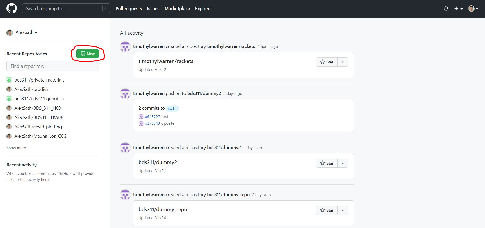
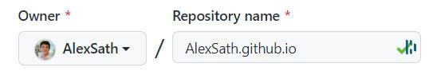

## Welcome to homework 08!

This week's homework can be split into two separate goals (each with its own sub-goals):
Question 1: Create your own gh-pages website, in which you will:
	- Create a new repository on github.com.
	- Convert it to a gh-pages website.
	- clone your repository on your local machine.
Question 2: Further explore the mauna-loa data by working on Python on your local machine.
	a. 
Get a repository that we've started for you onto your local machine.
	b. Begin coding on your local computer and using `.py` files.
	c. Determine correlations between data in mauna-loa.

*Note*: This homework assumes that you have successfully installed python and a terminal capable of running github. Completing these requirements will differ depending on your operating system, so please do this individually. That said, if you need help with this, email us!

### 1. Create your own gh-pages website

#### Part 1.1: Creating a new Repository
Go to <a href='https://github.com' target='_blank'>GitHub</a>. If you are logged in to your github account, you should be able to create a new repository by clicking the green button as pictured below:

Once clicked, you will be given options to configure your repository.

Your repository must be of the format `<account-name>.github.io`. In other words, repository should include **the exact same name as your account name**. If my account name were BillyBob, my github website repository will be called `BillyBob.github.io`.

This should be a public repository. No need to include a `README.md`, a `.gitignore`, or to choose a license.
 
#### Part 1.2: Convert the repository to gh-pages

Once the repository is created, you should be able to access it at the link `github.com/username/username.github.io`. If my username were `BillyBob`, the website would be `github.com/BillyBob/BillyBob.github.io`. 

Once at that URL, you should be able to click on the `Settings` Tab (with a gear icon).

In the `Settings` Tab, click on the `Pages` Icon under the `Code and Automation` section on the left of the screen.

Check to see if your screen matches the image below. Click on the button that says `change theme`. Choose whatever theme you like the most.

Github will probably take you to a screen with a sample markdown file. No need to edit the file for now. Simply scroll down and hit the large green button saying `Commit Changes`.
 

#### Part 1.3: Get repository onto local computer.

Go to our class webpage on [Git Repositories](bds311.github.io/git_repos) to get your gh-pages repository onto your local computer.

#### Part 1.4: Populating your website
Your gh-pages repository should have a single Markdown file to begin with: `index.md`. Change this file and commit/push these changes to github. The changes made to `index.md` will show up on `username.github.io`.

Next, on your local computer, create a new markdown file called: `experience.md`. Add a few lines about some of your work or professional experience. These changes will show up on `username.github.io/experience`.

Add a link to your *experience* page in `index.md`. Commit and push these changes to the remote github repository.

**IMPORTANT**: In the `hw08.ipynb` file on Jupyter Hub, add a link to your GH-Pages site in the cell labeled `Repository 1`. 

### Part 2: Running Python code on your Local Terminal

#### Part 2.1: Clone the Mauna Loa Repository

Go to the class [Mauna Loa Repository](github.com/bds311/mauna_loa) and clone the repository into a local directory. If you would are struggling with this, it may be helpful to visit our [Git Repositories Walkthrough](bds311.github.io/git_repos)
