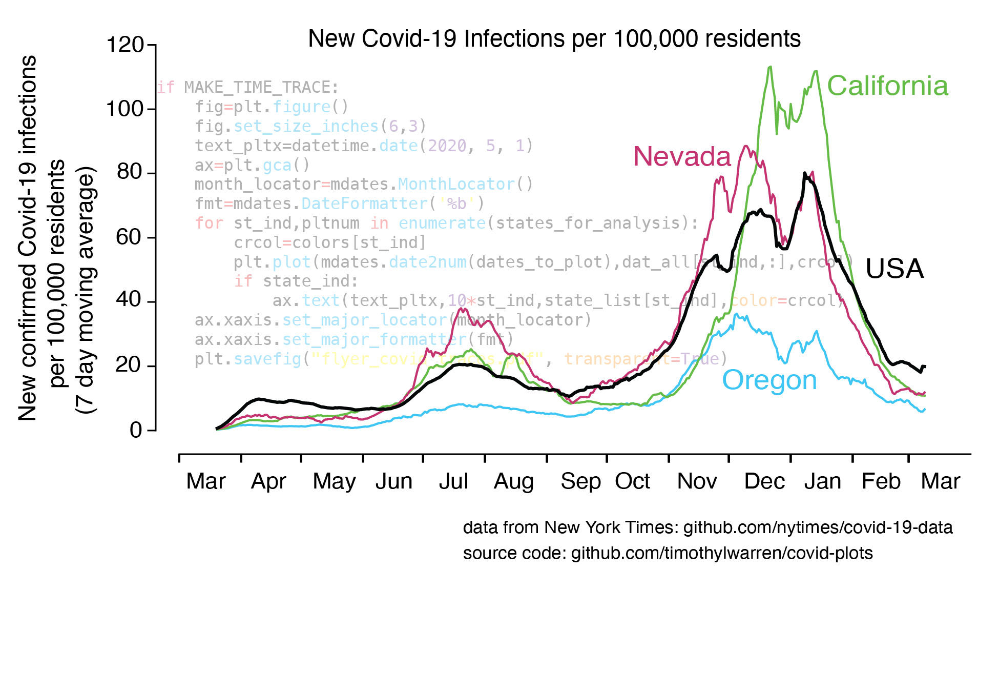
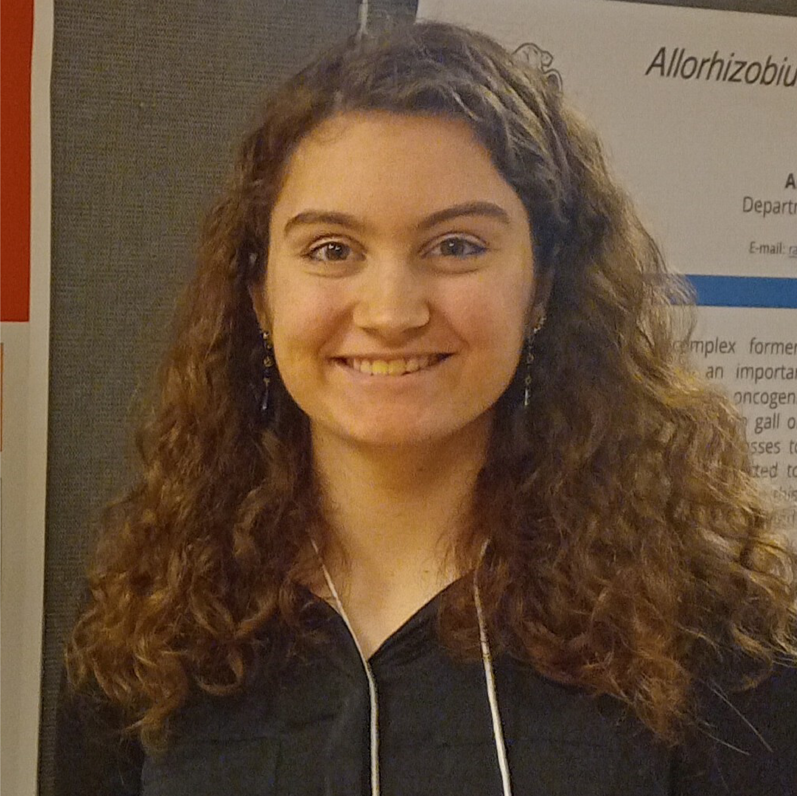

## Winter 2026

### Lecture: Tuesday/Thursday 10:00-11:20am, ALS 4000
### Recitation Section 1: Wednesday 1-2:30pm, Cordley 2602
### Recitation Section 2: Wednesday, 2-3:30pm, Cordley 2424

### Course Description
 <!---
  will replace this image
  
-->
 
 
 Introduces the fundamentals of data science with specific application to biology. Through a practical, problem-based approach, students will examine the theory and practice underlying widely used computational methods in biology. They will develop mastery in the analysis and visualization of large data sets using Python, with applications to genomics, ecology, and other areas of biology. Students will test hypotheses, infer dataset parameters, and make predictions via broadly applicable data science tools. 

   

### [Syllabus & Course Policies](./syllabus_25.md)

### Instructor
      

Timothy Warren  
tim.warren AT oregonstate.edu         

### Course Assistants

 ### Course Assistants

 <!-- First Row -->

  

     
    <strong>Andrea Schiffer (Head CA)</strong> 
    schiffan AT oregonstate.edu
  

     
    <strong>Steven Cai</strong> 
    caist AT oregonstate.edu
  

  

     
    <strong>Sarah Hoekema </strong> 
   hoekemas AT oregonstate.edu
  

  
  
  

  <!-- Second Row -->
  

     
    <strong>Morgan Miller</strong> 
    morgan.miller AT oregonstate.edu
  

  

     
    <strong>Imre Rist</strong> 
    risti AT oregonstate.edu
  

  
  

<!--
  
### Quiz 1 Review questions:
- ##### [quiz1 review](./class_notes/list_of_questions.html)

### Class notes
- ##### [Basics of Pandas DataFrames](./class_notes/basics_of_pandas_dfs.html)
- ##### [Basics of Matplotlib](./class_notes/plotting_with_matplotlib.html)
- ##### [Working with Pandas](./class_notes/working_with_pandas.html)
- ##### [Random Processes](./class_notes/random_processes.html)
- ##### [Titanic dataset: Groupby and truth indices](./class_notes/titanic_notes/titanic.html)
- ##### [Permutation Tests](./class_notes/permutation_tests.html)
- ##### [Bootstrapping](./class_notes/bootstrapping.html)
- ##### [Prediction Models](./class_notes/prediction_models.html)
- ##### [Error Minimization](./class_notes/error_minimization.html)
- ##### [Classification](./class_notes/classifiers.html)

-->

### BDS 310 class notes

- ##### [Intro to Python](./class_notes_310/Intro_to_Python.html)
- ##### [Intro to Unix](./class_notes_310/week1.html)
- ##### [Python data types and indexing](./class_notes_310/lists_slicing.html)
- ##### [Numpy](./class_notes_310/numpy.html)
- ##### [For loops](./class_notes_310/for_loop.html)
- ##### [Functions](./class_notes_310/functions.html)
- ##### [Conditional Statements and While Loops](./class_notes_310/conditionals.html)
- ##### [Matplotlib](./class_notes_310/matplotlib.html)
- ##### [Dictionaries](./class_notes_310/dictionaries.html)
- ##### [Reading and Writing Files]

### Weekly Calendar

|Date                                  | Topic                             |  Relevant Reading                     | Assignment                                 |
|:-----------------------------        |:--------------------------------- |:------------------------------------  |:----------------------                      |
| Week 1  01/06, 01/08&nbsp; &nbsp; &nbsp;&nbsp;&nbsp;| Course Goals and Philosophy  Unix Shell Scripts   Introduction to Pandas&nbsp; &nbsp; &nbsp;| [Jupyter Notebook](https://www.e-education.psu.edu/geog489/node/2204)&nbsp; &nbsp; &nbsp;&nbsp; &nbsp;&nbsp; &nbsp; [Unix Shell](https://swcarpentry.github.io/shell-novice/)   [Python Examples](https://nbviewer.jupyter.org/urls/bitbucket.org/hrojas/learn-pandas/raw/master/lessons/Python_101.ipynb) &nbsp; &nbsp;     [Pandas 10 min Reference](https://pandas.pydata.org/pandas-docs/stable/user_guide/10min.html) [Pandas tutorial](https://pandas.pydata.org/docs/getting_started/intro_tutorials/02_read_write.html)| HW0 (for students who did not take BDS 310) Due Fri 1/09  HW 01   Due **Fri 01/16** &nbsp; &nbsp; |
|        |                |         |            |
| Week 2   01/13, 01/15    | Analyzing Tabular Data with Pandas   Time Series and Visualization | <!---[Lists](https://swcarpentry.github.io/python-novice-gapminder/11-lists/index.html) [Numpy arrays   (Inferential Thinking Chap. 5)](https://inferentialthinking.com/chapters/05/Sequences.html) [Loops and Functions in Pandas](https://datacarpentry.org/python-ecology-lesson/06-loops-and-functions/)    -->                               | HW 2     Due Fri 01/23 |
|     |    |     |      |
| Week 3   01/20, 01/22    | Pandas synthesis;Introduction to Random processes |[matplotlib tutorial](https://matplotlib.org/stable/tutorials/index.html#tutorials) [Edward Tufte](https://www.edwardtufte.com/tufte/)   [Data Visualization textbook](https://clauswilke.com/dataviz/)                                                           | HW 3   Due Fri 01/30|
|     |    |     |      |
| Week 4   01/27, 01/29    |Application of Random processes: Permutation Testing|[Inferential Thinking: Chapter 11: Testing Hypotheses](https://inferentialthinking.com/chapters/11/Testing_Hypotheses.html) [Chapter 12: Comparing Two Samples](https://inferentialthinking.com/chapters/12/Comparing_Two_Samples.html) [Illustrated permutation test](https://www.jwilber.me/permutationtest/)     | HW 4    Due Fri 02/06 |
|     |    |     |      |
|  Week 5   02/03, 02/05   |  Resampling for hypothesis and estimation - the bootstrap |[Chapter 12: Comparing Two Samples](https://inferentialthinking.com/chapters/12/Comparing_Two_Samples.html) [Illustrated permutation test](https://www.jwilber.me/permutationtest/) [Chapter 13: Testing Hypotheses](https://inferentialthinking.com/chapters/13/Estimation.html) [Bootstrap schematic](https://online.stat.psu.edu/stat555/node/119/) [News article on origin of bootstrap](https://www.nytimes.com/1988/11/08/science/theorist-applies-computer-power-to-uncertainty-in-statistics.html)                                                  | HW 5    Due **Fri 2/20** |
|     |    |     |      |
| Week 6   02/10, 02/12    |The boot strap continued|**Quiz 1 02/12 **                               
|     |     |    |      |
|  Week 7   02/17, 02/19   |  Introduction to building and testing models for prediction  Regression and Correlation |**Quiz 1 02/18]**                                                |  |
|     |    |     |      |
| Week 8   02/24, 02/26    |Regression; Error-minimization for Model Fitting |        | HW 06  Due Tue 03/04 |
|     |    |     |      |
| Week 9   03/03, 03/05   |Introduction to Optimization and Machine Learning   |    **QUIZ 2 3/05**                              | |
|     |    |     |      |
| Week 10   03/10, 03/12    | Putting it all together   |                                     | HW 07    Due Wed 03/18  |

